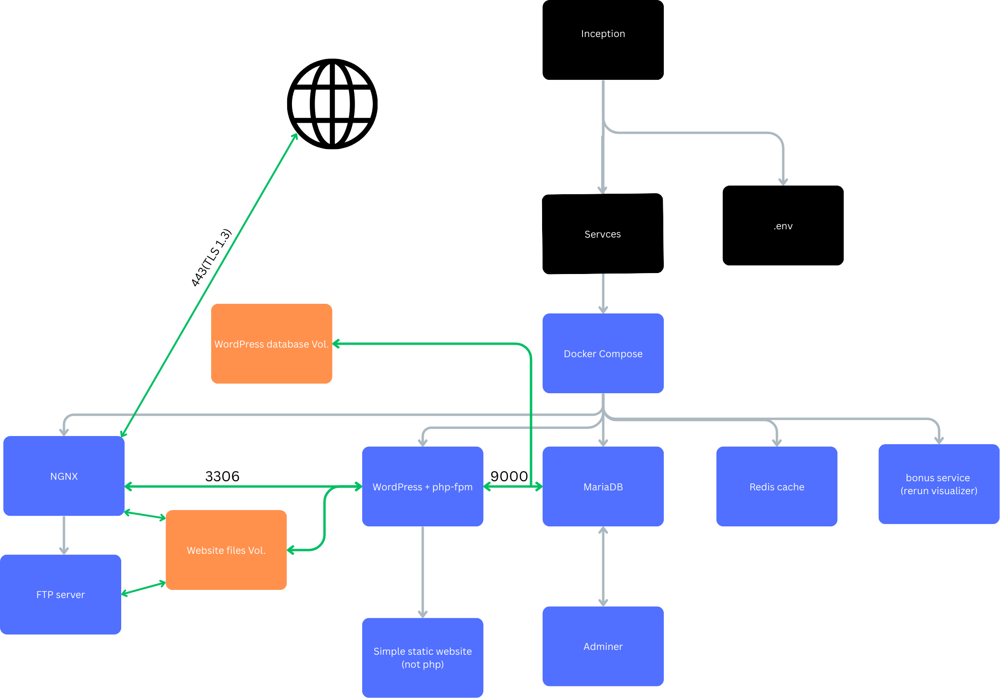

  *This project has been created as part of the 42 curriculum by yousef kitaneh*

---
# Table of Contents
- [Table of Contents](#table-of-contents)
- [Description](#description)
	- [Overview](#overview)
	- [Background and Clarifications](#background-and-clarifications)
		- [Virtualization vs Containerization](#virtualization-vs-containerization)
		- [Docker Secrets vs Environment Variables](#docker-secrets-vs-environment-variables)
		- [Docker Network vs Host Network](#docker-network-vs-host-network)
		- [Docker Volumes vs Bind Mounts](#docker-volumes-vs-bind-mounts)
	- [Design Choices](#design-choices)
- [Prerequisites and Instructions](#prerequisites-and-instructions)
- [Resources](#resources)
---
# Description
## Overview
 Inception is a full [LEMP stack](https://www.digitalocean.com/community/tutorials/how-to-install-linux-nginx-mysql-php-lemp-stack-on-ubuntu) implementation from scratch,
 all services are containerized alongside their dependencies using docker, communicating between each other through the docker network.

 a key requirement for this project is to implement all services from scratch above a minimal linux distribution.

 in this implementation, the following services are provided:
 - an nginx TLS1.3 reverse proxy server.
 - a mariaDB database server
 - adminer to manage the database
 - a wordpress + php-fpm application server
 - redis caching server to reduce database load
 - an FTP server
 - a simple static website to test the reverse proxy and enable .rrd file upload.
 - a rerun server to visualize .rrd files.

for instructions on how to use the built system, please refer to the [user documentation.](./USER_DOC.md)


<sup>a simple dfd of the system</sup>

## Background and Clarifications

### Virtualization vs Containerization
Containerization is a method of packaging software in a way that isolates it from the host system, mainly for the purpose of portability and consistency across different environments. (i.e. escaping dependency hell).

The container service uses in this project is ***Docker***, which isolates applications and their dependencies into a single package called a container image, which then run on the host's kernel, sharing system resources with other containers, while maintaining isolation from each other and the host system.

This is in contrast to traditional ***virtual machines*** which require a full guest operating system to run on top of the host system, making them more resource-intensive, but more isolated and portable, but since docker is more lightweight, it is more suitable for deployment environments.

In real deployments, both containerization and virtualization are often used together to leverage the benefits of both technologies, but it is important to understand their differences and use cases.

---
### Docker Secrets vs Environment Variables
You've successfully built your OpenAI chatbot wrapper, and you're smart enough to not hardcode the expensive API key into the application and leak it on the github repo, you also want to specify what port your application reads from, so you decide to store both variables in a file, and to keep them local, you .gitignore the file.

 You've just invented ***Environment Variables***, they are variables that differ based on their environment (development, testing, production), and are often used to store configuration settings such as API keys, database credentials, and other sensitive information.

while a .env file is a convenient and widespread way to manage environment variables, it is not the most secure method, in the end it's just a plaintext file, you're one misconfigured `git add .` away from leaking your secrets.

Docker provides a more secure way to manage sensitive information through ***Docker Secrets***, which are encrypted and stored within the container (`/run/secrets/`) and should be used for sensitive data such as passwords, API keys, and certificates, while environment variables can still be used for non-sensitive configuration settings.

### Docker Network vs Host Network
You want your containers to communicate with each other, what you could do is let them have access to the host's network and have them communicate through it's interface, this is called the ***host network*** mode, while it works, and sometimes it's optimal, its complex to manage, and conflicts happen frequently, especially when scaling up, since multiple containers might try to bind to the same host port.

Fortunately, docker provides a better way to manage container communication through ***docker networks***, which are virtual networks that allow containers to communicate with each other directly, and even providing a built-in DNS service to resolve container names to IP addresses, that way you can have `chatgptwrapper` container communicate with `db` container through the internal docker network, without exposing any ports to the host machine this greatly simplifies management, and reduces the risk of port conflicts.

Docker Network remains a virtual network with a slight performance overhead compared to host networking, but the benefits of simplified management and reduced risk of conflicts often outweigh the performance considerations in most use cases.
### Docker Volumes vs Bind Mounts
Docker containers are [ephemeral](https://www.merriam-webster.com/dictionary/ephemeral) and [stateless](https://www.redhat.com/en/topics/cloud-native-apps/stateful-vs-stateless#:~:text=There%20is%20no%20stored%20knowledge%20of%20or%20reference%20to%20past%20transactions.) by design, that is great for portability, but not so great when you want to take down your containers for maintenance, and not lose your database.

persistence is achieved through writing to the host's filesystem, and there are two main ways to do that in docker, depending on your use case:
- ***Bind mounts:*** are used when you want to share files between the host and the container, for example, during development, you might want to mount your source code directory from the host to the container, so that changes made on the host are reflected in the container in real-time, this is like you're sharing a usb between two computers, it is fast but brittle, if say the host's file path changes from `/~/admin1/project` to `/~/Admin1/project`, then the link is broken and the container can no longer access the files.

- ***Volumes:*** are used when you want to persist data generated by the container, for example, a database container might use a volume to store its data files, so that even if the container is deleted, the data remains intact, this is like having a dedicated hard drive for the container, it is more robust and easier to manage, as docker takes care of the volume's location and lifecycle, think of it as a pointer to the file on the host filesystem, but that pointer is managed by docker. <sub>it always circles back to pointers...</sub>

Use bind mounts for development, and volumes for production, is a good rule of thumb.

## Design Choices
 - alpine linux was chosen as the base image for all services due to its minimal size.
 - to ensure data persistence, volumes were created for the database and wordpress files.
 - to combat software rot, helper scripts were created to automate rebuilding the images with the latest software versions, and configuring environment variables.
 - to ease management, a makefile was created to wrap arounddocker compose commands and helper scripts.


# Prerequisites and Instructions
the only dependency you need is ***docker***, in addition to sudo privileges for docker to function properly.

managing the system's containers and volumes is done through a makefile which wraps around the docker compose.

 to build and run the project:
```bash
make up
 ```

to stop the containers:
```bash
make down
```
for an extensive list of management commands, please refer to the [developer documentation.](./DEV_DOC.m)

# Resources

below is the list of resources which I found useful while working on this project:

- [Docker's Reference](https://docs.docker.com/reference/)
- [Docker Best Practices](https://docs.docker.com/build/building/best-practices/)
- [How Compose Works](https://docs.docker.com/compose/intro/compose-application-model/)
- [The odo's guidelines to container management](https://cloud.theodo.com/en/blog/docker-processes-container)
- [docker image multi-staging](https://docs.docker.com/get-started/)
- [How to install a LEMP stack](https://www.digitalocean.com/community/tutorials/how-to-install-linux-nginx-mysql-php-lemp-stack-on-ubuntu)
- [Docker's beginner's guide](https://docs.docker.com/get-started/)

AI was used to aid in research and generate boilerplate code snippets, as well as proofreading documentation.